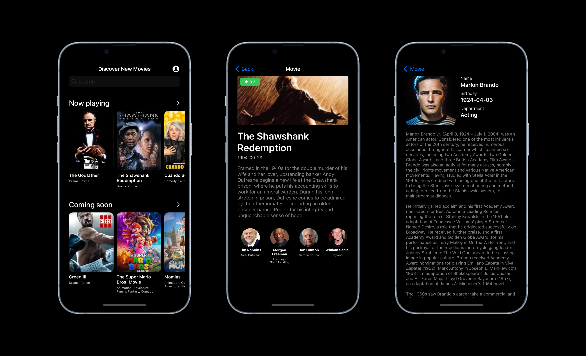

The MoviesApp is an iOS application that uses the VIPER architecture, Alamofire for networking, SnapKit for AutoLayout, Kingfisher for image caching, and the Movie Database API for movie information.

